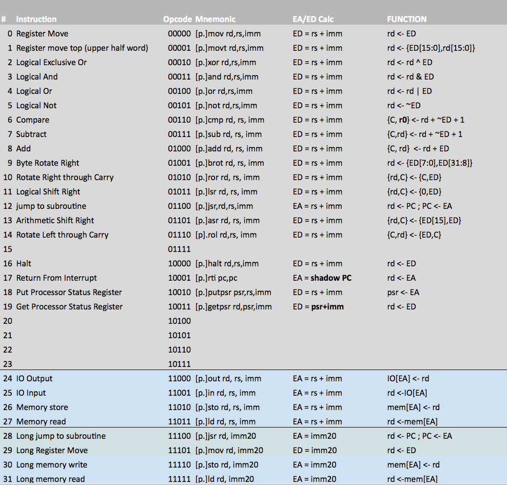

OPC7 Definition
-----------------

OPC-7 is a pure 32 bit [One Page Computer](.) with a 16 entry register file based very largely on the earlier
OPC-5LS machine.

All memory accesses are 32 bits wide and instructions are encoded in a single word in one of two formats ::

Standard instructions

    ppp ooooo dddd ssss  nnnnnnnnnnnnnnnn
      \    \   \     \           \_______  16b operand field
       \    \   \_____\___________________  4b source and destination registers
        \    \____________________________  5b instruction opcode
         \________________________________  3b predicate bits                         

Long instructions

    ppp ooooo dddd nnnn  nnnnnnnnnnnnnnnn
      \    \   \     \___________\________ 20b operand field
       \    \   \_________________________  4b destination registers
        \    \____________________________  5b instruction opcode
         \________________________________  3b predicate bits                         

On reset the processor will start executing instructions from location 0.

OPC-7 has a 16 entry register file. Most instructions specify one register as a source and another as both source
and destination, using the two 4 bit fields in the encoding. Two of the registers have special purposes:

  * R0 holds 'all-zeros'. It is legal to write to R0 but this has no effect on the register contents.
  * R15 is the program counter. This can be written or read like any other register.

The address bus and program counter are 20b wide rather than a full 32 bits. Whenever the program counter is
loaded into another register the top 12 bits will be zeroed.

Sign Extension

All 20b and 16b operands are sign-extended to a full 32b word length.

The valid range of a 16b immediate is 0x0000->0x7FFF and 0xFFFF8000->0xFFFFFFFF, with the exception of operands for the IN and OUT
instructions. The IO address range is limited to 16 address bits anyway so any 16b constant is valid for those two instructions.

Addressing Modes and Effective Address/Data Computation
-------------------------------------------------------

The 20b effective address or data (ED or EA) for all instructions is created by adding the 16b operand to the source register for standard
format instructions or is taken directly from the 20b operand word for long instructions. By using combinations of the zero register and zero
operands with the LD and STO instructions the following addressing modes are supported:

  |  Mode          | Source Reg | Operand   |  Effective address/Data  | Comment                 |
  |--------------- |------------|-----------|--------------------------|-------------------------|
  | Direct         | R0         | \<addr\>  | mem[\<addr\>]            | 16b operand             |
  | Indirect       | \<reg\>    | 0         | mem[\<reg\>]             | 16b operand             |
  | Indexed        | \<reg\>    | \<index\> | mem[\<reg\> + \<index\>] | 16b operand             |
  | Immediate      | R0         | \<immed\> | \<immed\>                | 16b operand             |
  | Long Immediate | -          | \<immed\> | \<immed\>                | 20b operand             |

Processor Status Register
-------------------------

The processor has an 8 bit processor status register. Included in this are three processor status flags which 
are set by ALU operations - calculation of the EA/ED values has no effect on these - and 5 bits related to interrupt
handling. 

  * SWI   - 4 bits used to identify a software interrupt. Writing a non-zero value here triggers a SWI.
  * EI    - used to enable or disable hardware interrupts
  * Carry - set or cleared only on arithmetic operations
  * Zero  - set on every instruction based on the state of the destination register
  * Sign  - set when the MSB of the result is a '1'

Instruction Set
---------------

Notes:

  * Where a [p.] is shown in the table, the instruction can be prefixed with a predicate (see table below) for conditional execution dependent on the state of the chosen flags
  * All effective data/address calculations are truncated to 32 bits and do not affect any of the processor flags
  * add rd,rd can be used to synthesize an arithmetic shift left (asl) instruction

Predication
-----------

All instructions can have predicated execution and this is determined by the three instruction MSBs and indicated by
a prefix on the instruction mnemonic in the assembler.

  | P0 | P1 | P2 | Asm Prefix | Function                                           |
  |----|----|----|------------|----------------------------------------------------|
  |  0 |  0 |  0 | 1. or none | Always execute                                     |
  |  0 |  0 |  1 | 0.         | Never execute (nop)                                |
  |  0 |  1 |  0 | z.         | Execute if Zero flag is set                        |
  |  0 |  1 |  1 | nz.        | Execute if Zero flag is clear                      |
  |  1 |  0 |  0 | c.         | Execute if Carry flag is set                       |
  |  1 |  0 |  1 | nc.        | Execute if Carry flag is clear                     |
  |  1 |  1 |  0 | mi.        | Execute if Sign flag is set                        |
  |  1 |  1 |  1 | pl.        | Execute if Sign flag is clear                      |
  
Byte Permute Function
---------------------
							
OPC7 has a powerful byte permute function which can perform various byte-wise shifts, rotations, swaps and replication.		
							
Bytes are picked from the source register (rs) and placed into the destination register (rd) according to the bit pattern
provided in the 16b immediate data. The lower 16 bits of this control word are split into 4 nybbles. The lower two bits
of each nybble determine which byte of the source will be placed in the corresponding byte position of the destination.
Bytes (and nybbles) are numbered from 3 down to 0 reading from left to right (MSB to LSB). This is best illustrated
with some simple examples:
							
    BPERM rd,rs,0x3210  Has no effect on r1 - all bytes are put back in their original positions
    BPERM rd,rs,0x0123  Reverses the order of the bytes in r1					
    BPERM rd,rs,0x0321  Byte-wise rotate right					
    BPERM rd,rs,0x2103  Byte-wise rotate left					
    BPERM rd,rs,0x1032  Half-word swap/rotate					
    BPERM rd,rs,0x0000  Replicate byte 0 into all bytes					
    BPERM rd,rs,0x2301  Shuffle bytes (rotate within half-words)					
							
In addition to picking bytes from the source, it's possible also to specify that bytes should be zeroed by setting bit 2
of the appropriate control word nybble. Again, with some examples

    BPERM rd,rs,0x4444  Zeroes all bytes in the destination 
    BPERM rd,rs,0x4441  Zeroes the upper 3 bytes of the destination and 
                        moves byte 1 from the source reg into byte zero
							  
Interrupts
----------
  
OPC7 has two interrupt inputs for hardware interrupts: int\_b[1:0].
  
If either of these inputs is taken low, then the processor with finish executing the current instruction and jump to a restart vector at either 0x0002 (for int\_b[0]) or 0x0004 (for int\_b[1]). If both interrupt pins are low at the same time then the processor will jump to 0x0004 to service int\_b[1] first.
  
Additionally there is an ability to cause software interrupts by writing a non-zero value to the SWI bits (see above) using the PUTPSR instruction. Software interrupts are also vectored to address 0x0002 in common with the hardware interrupt for int\_b[0]. The interrupt service routine is responsible for reading the processor status register to determine the interrupt source.
